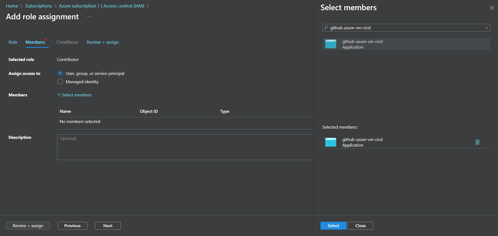
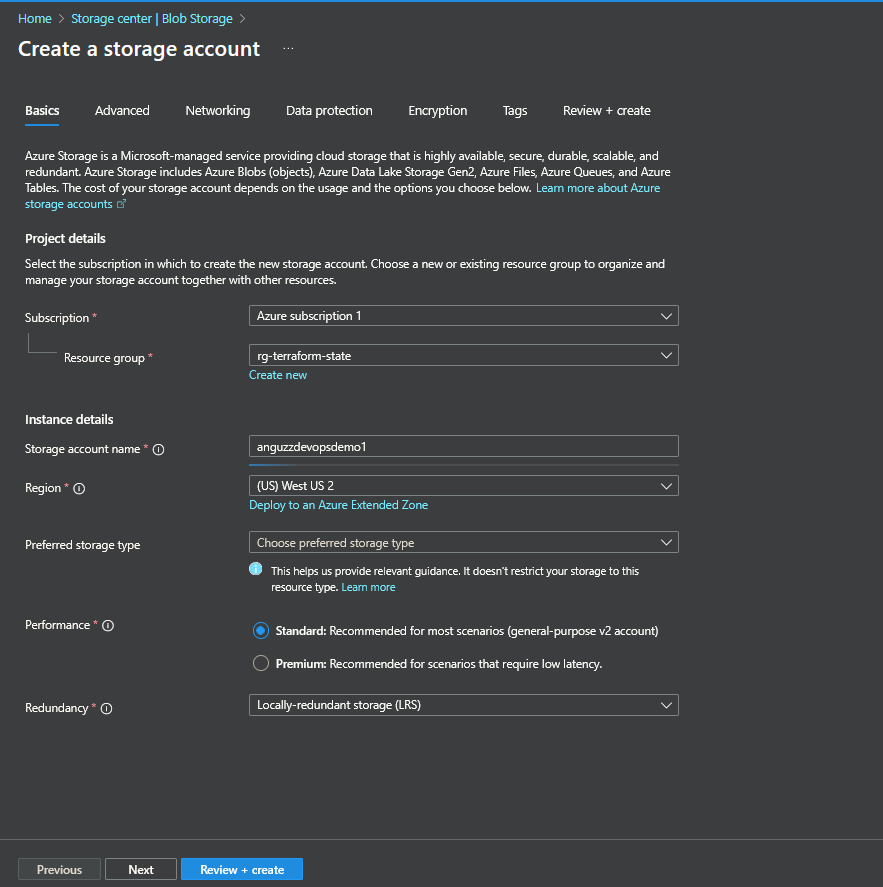
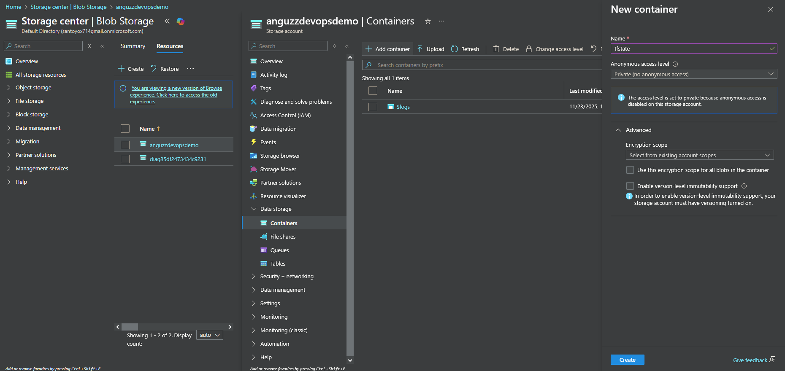
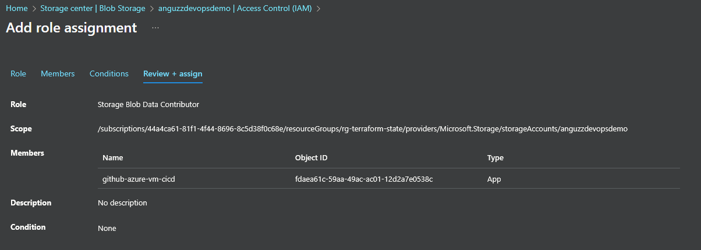
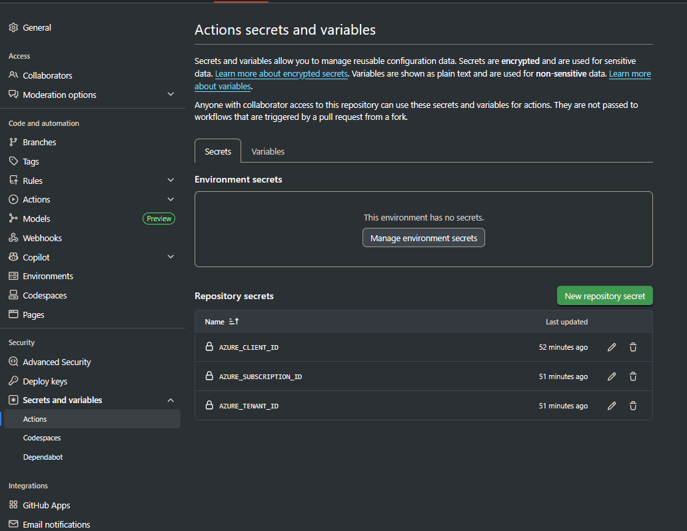
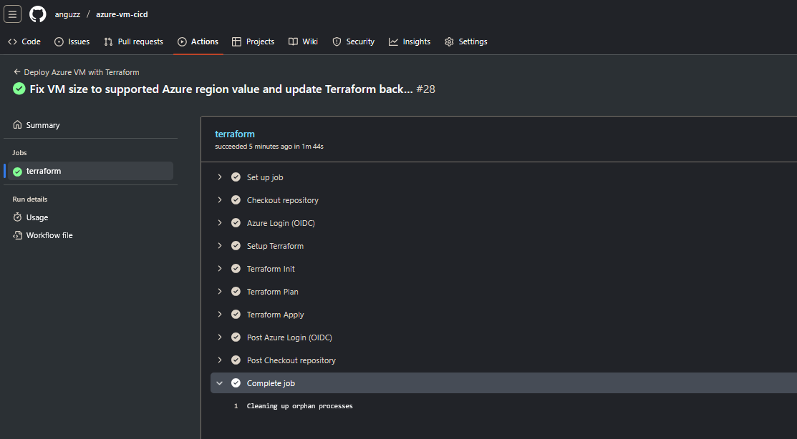
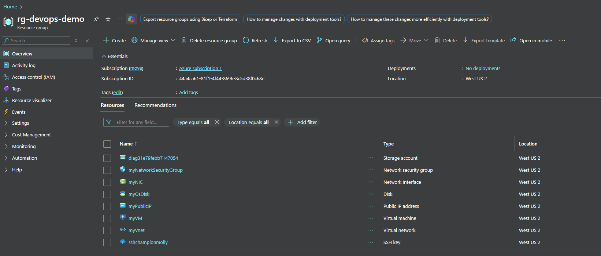
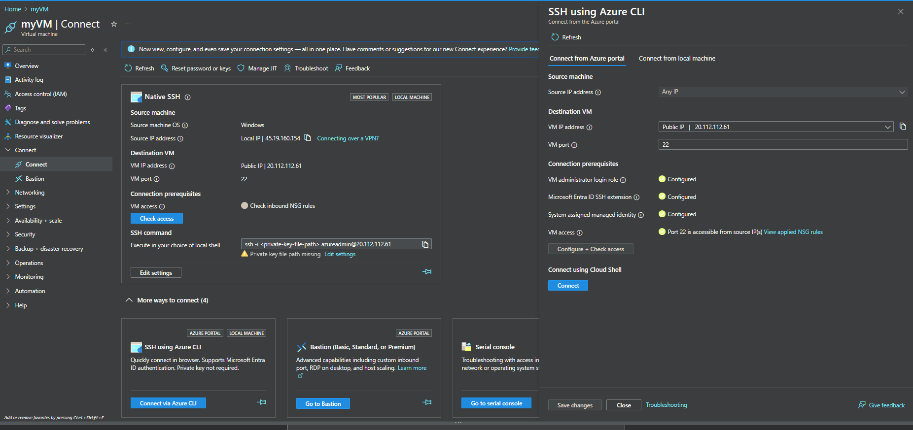
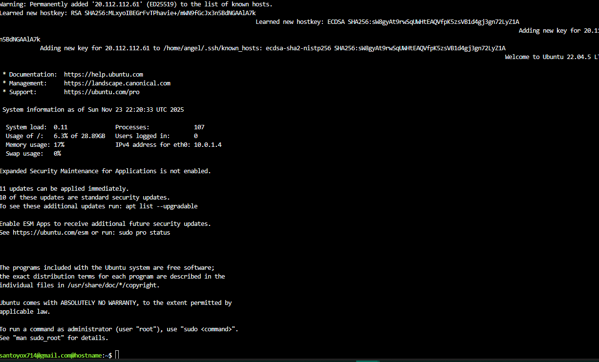

# azure-vm-cicd

Automated Azure VM deployment using GitHub Actions and Infrastructure as Code. This project is intentionally designed to deploy **one Azure VM**, with its configuration defined in Terraform and continuously managed through GitHub Actions. The Terraform state tracks this VM so the pipeline can update, recreate, or reconcile changes over time.

### **How This Deployment Model Works**

* Infrastructure is defined as code (IaC) using Terraform.
* A single VM is created based on values in `variables.tf`.
* Terraform state stored in Azure Storage ensures consistent updates.
* Each workflow run validates, plans, and applies changes to **that same VM**.

This repo currently assumes:

* **One VM**
* **Some hardcoded configurations**
* **Terraform managed lifecycle**
* **Long-term stateful management*

# **Future Scaling Options (Conceptual)**

This project currently manages a single VM, but it can be expanded depending on future needs:

### **1. Multiple Persistent VMs**

Terraform can manage several VMs at once using the same state file. Useful for full environments like `vm2`, `web02`, `db01`.

### **2. Modules or Workspaces**

Modules let you reuse the VM definition many times.
Workspaces allow separate state files per VM or environment.
Both improve organization as deployments grow.

### **3. Ephemeral / On-Demand VMs**

Terraform is not designed to create a new VM every workflow run, since state becomes unmanageable.
For disposable or short-lived compute, use tools like:

* Azure CLI
* Bicep/ARM templates
* DevTest Labs
* VM Scale Sets
* Kubernetes (for containerized workloads)


  
# Directroy structure

```
root/
├── .github/
│   └── workflows/
│       └── deploy.yml
│       └── configure-ansible.yml
├── terraform/
│   ├── main.tf
│   ├── variables.tf
│   └── outputs.tf
│   └── providers.tf
│   └── ssh.tf
│   └── ssh_key.pub
├── ansible/ 
│   ├── configure-python.yml
│   
├── README.md
```

# Setup process


### 1) Setup an Entra app registration

Go to https://portal.azure.com/#home

- Microsoft Entra ID > App registrations > New registration

- `github-azure-vm-cicd`

- `Default directory only - Single tenant`

*For our current use case we do not need Multi-tenant access, Personal Microsoft accounts ,External users, or Redirect URIs*

### 2)  Link the App Registration to the Azure Subscription (Assign RBAC Role)

To allow GitHub Actions to deploy Azure resources using OIDC, the App Registration must be granted access to your subscription. 

### **Steps:**

1. Navigate to
   **Home > Subscriptions > *Azure subscription 1***
2. Open
   **Access control (IAM)**
3. Click **Add → Add role assignment**
4. Select the **Contributor** role
5. Click **Next**, then choose:
   **User, group, or service principal**
6. Click **Select members** and search for: `github-azure-vm-cicd`
7. Select it > **Review + assign**

This grants GitHub’s identity permission to create/update Azure resources using Terraform.




### 2) Enable OIDC Federated Identity

OIDC (OpenID Connect) federated identity is a way for GitHub Actions to log into Azure without using secrets, passwords, or client secrets. It sets up a direct trust between Azure & Github.

Go to  `App registration` > `github-azure-vm-cicd |certifcates & secrets` > `Federated Credentials` > `Add credential`
 

- Federated credential scenario : GitHub Actions deploying Azure resources
- Organization: anguzz
- Repository: azure-vm-cicd
- Entity type: Branch
- GitHub branch name: main
- Credential details: github-oidc-main
- Description: OIDC federated credential for GitHub Actions (main branch) deploying Azure resources.


### 3) Create Azure Storage Account for Remote State

To ensure deployment state is maintained across GitHub Actions runs and to prevent the "resource already exists" error, Terraform state must be stored remotely in a dedicated Azure Storage Account.

**Note:** This Storage Account must be created **manually** or using a separate, one-time Terraform run, as it is a dependency for all subsequent infrastructure deployments.

#### **Steps:**

1.  Navigate to the Azure Portal and create a new **Resource Group** dedicated to state (e.g., `rg-terraform-state`). (Optional, but recommended for clean separation.)

2.  Create a **Storage Account** with a globally unique name (e.g., `anguzzdevopsdemo`) inside this Resource Group.
    * **Account Kind:** General-purpose v2
    * **Performance:** Standard
    * **Redundancy:** LRS (Locally-redundant storage)



3.  Once the Storage Account is created, navigate to the **Containers** blade and create a new container named **`tfstate`**.

This dedicated account is referenced in `terraform/providers.tf` to define the **backend** location.


\


### 4) Grant Storage Data Access

While the general **Contributor** role allows managing resources, it does **not** grant permission to read or write data *inside* a Storage Account. To allow Terraform to save the state file (`.tfstate`), you must explicitly assign a data-plane role.

**Steps:**

1.  Navigate to the Storage Account you created (e.g., `anguzzdevopsdemo`).
2.  Open **Access control (IAM)** \> **Add role assignment**.
3.  Select the **Storage Blob Data Contributor** role.
4.  Assign it to your App Registration: `github-azure-vm-cicd`.




### 5) Create github actions and add secrets
- Under the repo goto `settings`
- Go to `secrets & variables` > `actions`
- New Secret
- Add the secrets and the corresponding values in `.env-example`

It should look something like this:



### 6) Create github action workflow.

The GitHub Actions workflow I created in `.github/workflows/deploy.yml` runs Terraform against the files in the `terraform/` folder:


#### Terraform Overview

- **main.tf** – defines all Azure resources (resource group, network, public IP, NIC, and the Ubuntu VM).
- **variables.tf** – holds input values such as VM name, region, size, admin username, and SSH key path. You can customize these.
- **outputs.tf** – prints useful information after deployment, such as the VM’s public IP.

Terraform will automatically create any resources that do not already exist (including the Resource Group). GitHub Actions handles the deployment by running `terraform init`, `plan`, and `apply` on each push to `main`.


## Redeploying the VM

To redeploy the VM at any time, go to:

```
GitHub > Actions > Deploy Azure VM > Run workflow
```

This will:

* Force a full redeploy
* Apply any new Terraform changes
* Recreate the VM if it was deleted in Azure
* Ensure the VM always matches the state defined in code


##  Deployment  (Working CI/CD Pipeline)

A full end-to-end deployment was successfully executed through GitHub Actions:

* Code pushed to **main**
* GitHub Actions authenticated to Azure using **OIDC**
* Terraform ran **init → plan → apply**
* All Azure resources were created automatically
* The VM is now reachable via SSH
* Remote state stored in Azure Storage

**GitHub Actions Run:**



**Deployed Resources:**




##  Connecting to the Deployed VM

Once the pipeline successfully executes, the Virtual Machine (`myVM`) is running and ready for access.

### 1. Connect via Azure CLI (Recommended for Initial Access)

The Azure CLI offers a quick way to establish an SSH connection without manually handling the private key on your local machine, using built-in identity management (assuming you are authenticated locally via `az login`).







### 2. Connect via SSH Key (Requires Local Private Key)

Alternatively, you can connect directly using the private key that Terraform dynamically generated and stored in your remote state file.

  * **Retrieve the Key:** Run the following commands in your local terminal (ensure you have run `terraform init` and `az login` first):

    ```bash
    terraform output -raw private_key_pem > mykey.pem
    # Linux/Mac only:
    chmod 600 mykey.pem 
    ```

  * **SSH Command:** Use the key file and the public IP address:

    ```bash
    ssh -i mykey.pem azureadmin@<VM_PUBLIC_IP_ADDRESS>
    ```

# **Ansible Setup **


1. **Terraform generates the SSH keypair**
   Terraform uses `azapi_resource_action` to create an SSH key.
   The public key is injected into the VM at build time.

2. **Terraform remote state stores the private key securely**
   The private key is available as a sensitive output:

   ```hcl
   output "private_key_pem" {
     value     = azapi_resource_action.ssh_public_key_gen.output.privateKey
     sensitive = true
   }
   ```

3. **GitHub Actions retrieves the private key at runtime**
   The workflow loads the private key directly from the Terraform output:

   ```bash
   PRIVATE_KEY=$(terraform output -raw private_key_pem)
   echo "$PRIVATE_KEY" > ~/.ssh/id_rsa
   chmod 600 ~/.ssh/id_rsa
   ```

4. **A dynamic inventory is generated for Ansible**
   The VM IP and SSH key are inserted into `ansible/inventory.ini` automatically:

   ```bash
   echo "[vm]" > ansible/inventory.ini
   echo "$VM_IP ansible_user=azureadmin ansible_ssh_private_key_file=$HOME/.ssh/id_rsa ansible_ssh_common_args='-o StrictHostKeyChecking=no'" >> ansible/inventory.ini
   ```

5. **GitHub Actions runs the Ansible playbook**
   No secrets, no manual keys, no local setup. 

## Build validation


## Client side validation

As can be seen below all the dependencies in our `configure-python.yml` playbook were installed.


# Resources
https://learn.microsoft.com/en-us/azure/virtual-machines/windows/quick-create-terraform

https://learn.microsoft.com/en-us/azure/virtual-network/ip-services/public-ip-addresses#limitations

https://learn.microsoft.com/en-us/azure/virtual-machines/linux/quick-create-terraform?tabs=azure-cli

https://learn.microsoft.com/en-us/azure/virtual-machines/windows/quick-create-terraform?tabs=azure-cli 
